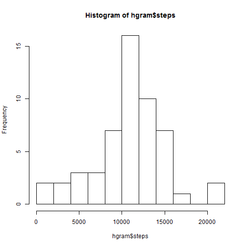
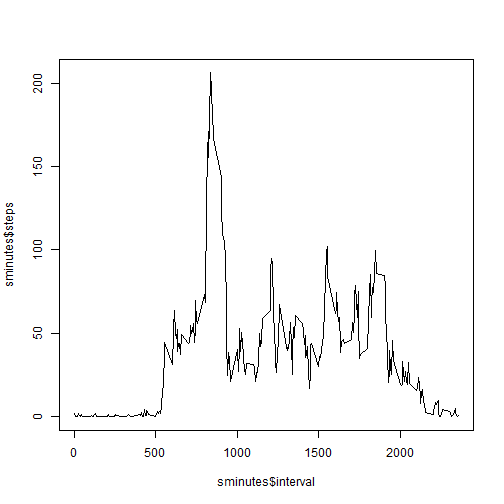
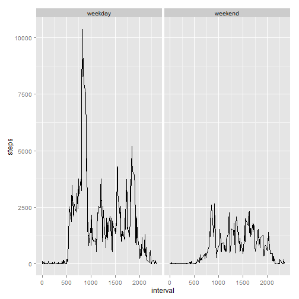

### Loading and processing the data


```r
setwd("C:/users/jpet/coursera/datascience/reproducibleresearch")
data <- read.csv("activity.csv")
```


```r
dataclear <- data[complete.cases(data),]
```

### What is mean total number of steps taken per day?


```r
library(dplyr)
hgram <- summarize(group_by(dataclear, date), sum(steps))
colnames(hgram) <- c("day", "steps")
hist(hgram$steps, 15)
```

 

```r
mean <- mean(hgram$steps)
median <- median(hgram$steps)
```

The daily mean of steps is 1.0766189 &times; 10<sup>4</sup> and median of steps in one day is 10765.


 ### What is the average daily activity pattern?
 
 

```r
sminutes <- summarize(group_by(dataclear, interval), mean(steps))
colnames(sminutes) <- c("interval", "steps")
plot(sminutes$interval, sminutes$steps, type = "l")
```

 

```r
max <- sminutes[sminutes$steps == max(sminutes$steps),1]
```

 On average, maximum steps are taken in five minute interval with beginning at 835.
 
 
 ### Imputing missing values
 
 

```r
nas <- sum(!complete.cases(data))
```

Total number of incomplete rows is 2304.

All missing values will be filled by median of particular interval. Let's look what happen?


```r
for (i in 1:length(data[,1])) {
        if (is.na(data[i,1]) == TRUE) {
                data[i,1] <- sminutes[sminutes$interval == data[i,3],2]
        }
}

datanew <- summarize(group_by(data, date), sum(steps))
colnames(datanew) <- c("day", "steps")
mean2 <- mean(datanew$steps)
median2 <- median(datanew$steps)
```

Previous means and median was 1.0766189 &times; 10<sup>4</sup> and 10765 respecitively. After inserting estimated valuest instead of NAs, mean and median of steps per day is 1.0766189 &times; 10<sup>4</sup>, 1.0766189 &times; 10<sup>4</sup> respectively.


### Are there differences in activity paterns between weekdays and weekends?


```r
for (i in 1:length(data[,1])) {
        if (strftime(data[i,2], '%u') < 6) {
                data[i,4] <- "weekday"
        } else {
                data[i,4] <- "weekend"
        }
}

colnames(data)[4] <- "wday"
weekends <- summarize(group_by(data,interval,wday), sum(steps))
colnames(weekends) <- c("interval","wday", "steps")

library(ggplot2)

qplot(interval, steps,data = weekends, facets = ~ wday, geom = "line")
```

 
